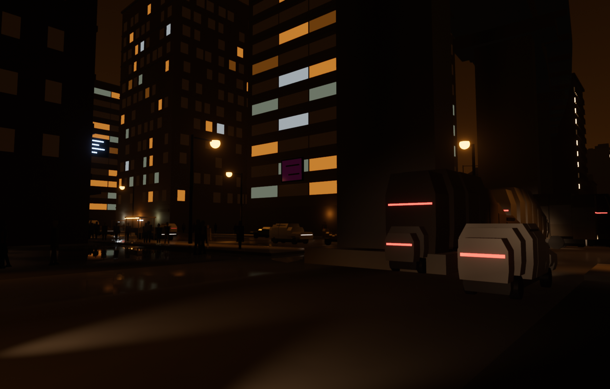
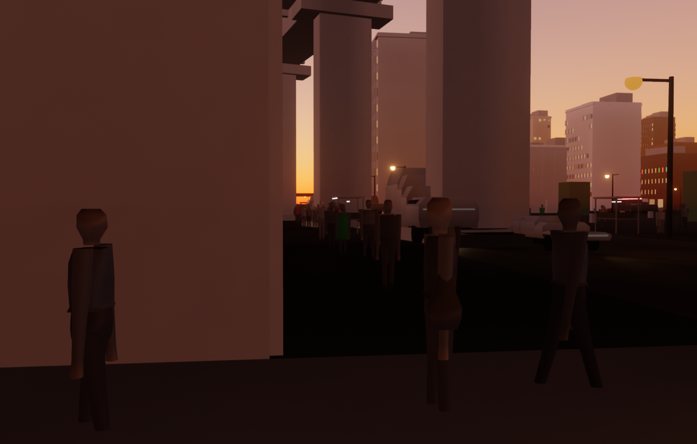
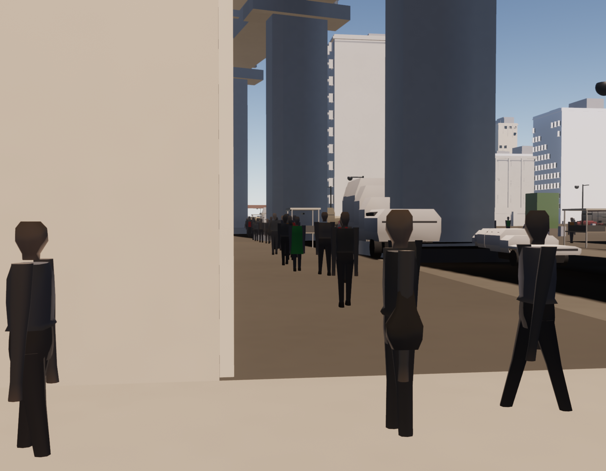
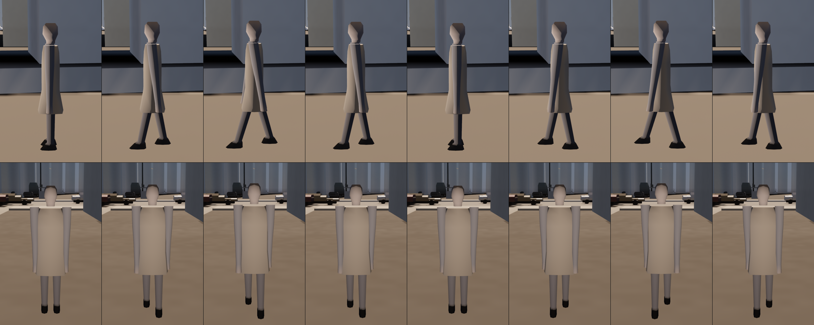

# NOCTIS

A city that generates itself in the browser. Every building, road, vehicle,
pedestrian, street lamp, sign and rain streak is computed at runtime from a
seed — there are no downloaded models, no textures, no baked lighting and no
authored geometry of any kind, only [three.js](https://threejs.org), 23 700
lines of source and 12 400 lines of instrument. On the machine named below it
holds **12.4 ms a frame** at 2560×1440 internal resolution through the densest
of its three camera routes.

The city is the demo. **The interesting part is how it was verified**, and that
is what most of this file is about.



---

## The numbers

Every figure here comes out of one log file:
[`tools/perf-out/quiet-gates-20260809-094953.log`](tools/perf-out/quiet-gates-20260809-094953.log).
Nothing below was typed from memory.

**Machine.** Apple M4, ANGLE Metal renderer, headless Chromium driven by
Playwright. Internal render resolution 2560×1440, device pixel ratio 1.

**Protocol.** Frame times are only recorded from a machine that has been
measured quiet. `tools/quiet-gates.sh` reads the one-minute load average and
every process over 15% CPU, refuses to run the battery unless load is at or
under **1.6**, and refuses a *configured bar* below this machine's own measured
idle floor of **1.32** — a threshold you cannot meet is not a strict threshold,
it is no measurement at all. The run below was admitted at load1 **1.59** with
nothing over 15%. Runs taken outside that window are logged under a different
filename so they can never be mistaken for these.

| route | wall p95 | the three runs | ceiling | CPU p95 | draw calls | triangles | instances |
|---|---|---|---|---|---|---|---|
| `downtown_dense` | **12.40 ms** | 11.5 · 12.4 · 12.9 | 12.5 | 11.70 ms | 380 | 1.21 M | 122 459 |
| `highway_speed` | **9.40 ms** | 9.4 · 9.4 · 9.5 | 12.5 | 8.90 ms | 438 | 1.45 M | 165 995 |
| `night_rain` | **12.60 ms** | 12.3 · 12.6 · 12.6 | 13.0 | 11.90 ms | 380 | 1.20 M | 149 030 |

**Provenance, because a stale figure is worse than none. THIS TABLE IS OUT OF
DATE AND THE COUNTS IN IT ARE WRONG BY MORE THAN THE FRAME TIMES.** The log was
taken two sessions ago. Since then the city gained its road surface — every
carriageway and pavement outside the origin block had been wound inside-out and
discarded by the rasteriser in every frame this project had ever produced — and
its street furniture went from one shared box to twenty-three models. Both
change the delivered counts, and the counts are the half of this table that does
not need a quiet machine:

| route | draw calls, quiet log → session 14 | triangles | visible instances |
|---|---|---|---|
| `downtown_dense` | 380 → **322** | 1.21 M → **1.23 M** | 122 459 → **126 273** |
| `highway_speed` | 438 → **425** | 1.45 M → **1.43 M** | 165 995 → **170 868** |
| `night_rain` | 380 → **329** | 1.20 M → **1.23 M** | 149 030 → **153 533** |

The draw calls fell because three per-chunk meshes were merged into one each in
session 13 and because session 14 stopped emitting a back face on every wall
sign; the triangles and the instances rose over the same span. That is the whole
argument for **`floors.drawCalls` moving from 360 to 300** in session 14 — a
number a rendering fix moves in the wrong direction is measuring rendering
efficiency and not content — and the arithmetic is in `tools/budget.json` under
`floors.$drawCalls_correction`. The band 300–440 is met at both ends for the
first time.

The frame times have NOT been re-measured on a quiet machine and everything in
the millisecond columns above is a figure for a city with no roads in it.
Session 14's loud-machine run put `downtown_dense` at 12.20 ms CPU p95 and
13.10 ms wall p95, over both bounds — with a run-to-run spread of 1.8 and 1.9 ms
against breaches of 0.20 and 0.60, so those two reds are inside the instrument's
own noise and are not verdicts. `STATE.md` §0 says what is required and why it is
the operator's job; until that log exists, read the millisecond columns as
history.

Shared ceilings: 440 draw calls, 2 000 000 triangles, 12 ms CPU p95, 192 MB of
texture memory, at most 3 frames over 33 ms in a 1800-frame capture.
`night_rain` carries its own 13.0 ms wall ceiling; the argument for it — the
arithmetic, and the measurement of the fix that failed to move the number the
ceiling was raised over — is written into that key in `tools/budget.json` and
summarised in [`STATE.md`](STATE.md).

**The estimator is written down beside the threshold**, and this matters more
than the numbers. Each route is captured three times for 1800 frames after 300
frames of warm-up, and the reported figure is the **median of the three runs'
p95** — not the mean, which carries a drifted run at full weight, and not a
percentile over frames pooled across runs, which is a different quantity
altogether. Changing the estimator is never allowed to move a threshold.

Content, from session 14's `citycheck` — all counts, so all verdicts: 360
pedestrians over 9 chunks, 1 598 props and **0** inside a building footprint,
604 delivered sign quads and **0** inside a building, signs in 4 mountings with
a standoff spread of 2.384 m, 341 stalls in 5 kinds under 8 awning cloths whose
widest pair is 0.4559 apart in linear reflectance, 369 generated signs of which
32.5% are dead, 5 architectural eras, 74.0% of 2 423 objects off the axis grid,
79 314 of 79 314 walkable cells reachable on foot, 8 landmarks all reachable,
and 10.76% peak chromatic saturation against a 12% ceiling.



---

## Seven gates

`npm run gates` runs them in order and stops at the first failure.

| gate | what it measures |
|---|---|
| `parsecheck` | Static structure. 68 files parse, and no module imports another module — they meet only through a context object, so any one of them can be deleted and the rest still boot. |
| `faultcheck` | Fault injection, end to end. Seven cases make a module throw at each lifecycle phase; each must be quarantined, logged exactly once, and the frame must keep rendering. |
| `lookcheck` | Eight captured frames at four times of day, dry and wet. Wall albedos must form distinct clusters, facade roughness must vary, buildings must differ in era, window rhythm, ground floor, floor height and cornice — measured off the decoded PNG, not off the generator's intentions. |
| `windcheck` | The winding of every generated mesh, three ways whose blind spots do not overlap: signed volume over closed meshes, the authored normal against the triangle's own facing, and the fraction of area presenting its front to an eye — over 678 meshes at six poses. Four controls stand IN the scene beside the city, two of which must fail. |
| `citycheck` | Claims about the city as a place: clumping, prop and SIGN placement, street level, vintage, alignment, negative space, walkability, landmark reachability, and the chromatic-saturation reserve. |
| `perfcheck` | Frame time, draw calls, triangles, memory, motion-vector integrity, and the silhouette assertions on vehicles and people. |
| `gateaudit` | The meta-gate. It perturbs every `lookcheck` capture and requires each threshold to reject, then runs the other gates' `--falsify` self-tests as subprocesses. |

**The rule that makes them worth anything: every gate carries a known failing
case, and that case is exercised on every run.**

A gate you have never seen fail is not a gate — it is a line of code that has
always printed a tick. So each gate has a `--falsify` mode that builds a fixture
inside every bound, asserts it produces **zero** failures, then perturbs one
thing at a time and requires each perturbation to produce at least one. It is
two-sided on purpose: a one-sided test happily passes an assertion that rejects
everything, and this project shipped one of those — a walkability flood fill
that reached one cell out of 67 568.

Coverage is machine-checked rather than declared. The self-test scans its own
source for failure sites and requires a case for each; the required coverage is
100%. The last run: **`perfcheck --falsify` rejected 70 of 70 cases across 69
failure sites, `citycheck --falsify` 39 of 39, `windcheck --falsify` 11 of 11** —
including cases that must *not* fail, because an estimator that can only get
stricter is a rubber stamp pointing the other way.

`windcheck`'s eleven include three that are not rejections at all but **declared
blind spots**: the facing test must PASS a reversed closed box, because a closed
shell presents about half its area to any eye whichever shell is drawn — which
is the entire reason this gate exists — and the volume test must DECLINE both
open controls, because a quad encloses nothing. An expectation was written the
other way, the first run refuted it, and the expectation moved rather than the
instrument. A blind spot that stops holding is as much a change as a failure
that stops failing, so both are asserted.



---

## The failure-mode table

Twenty-five bugs in this repo have been the same bug.

**The shape:** a number is computed correctly, and then used as though it were a
different quantity. Both have the same type, roughly the same units and entirely
plausible magnitudes. Nothing throws, nothing is `undefined`, and the frame
renders *nearly* right — right enough that no amount of looking at it will tell
you which of the fifty numbers upstream is the wrong one.

A sample from [`CONTRACT.md` §9](CONTRACT.md), which carries all twenty-five:

| what was computed | what it was used as | how far off |
|---|---|---|
| the mean of a set of horizon **angles** | the angle at which to threshold | 42° where the answer was 3/7 |
| a fraction of peak **candela** | a fraction of **lumens** | a 9% light leak that was 44% of the fixture |
| a landmark's **arc length** | its footprint **radius** | a 480 m keep-out; a quarter of the map sterile |
| the **GPU** bytes of an array texture | the bytes it costs **resident** | half the real figure, in every line of the budget |
| a **count** of deck stations ("every third") | a **length** in metres | piers at 48 m where the data said 34 |
| what blocks a ray **to the sky** | what blocks a **pedestrian** | 480 m of viaduct deck laid across the walkability mask |
| a wheel's **bounding box** | the wheel's **silhouette** | the bottom rows of a round tyre's mask are 69% road, so six vehicles measured a ground band *brighter* than their own body |
| a **frame count** | a **duration** | the census timed out and measured a partial city on any machine that renders fast |
| a **single run's** p95 | the **route's** p95 | a 0.10 ms breach decided against a 0.40–0.80 ms noise floor — red about one run in three |
| a lofted surface's **shading normal** | the **facing of its triangles** | every pedestrian rasterised its far wall, so the body drew in front of its own clothes |
| a building's **centre** | the building's **elevation** | 208 of 208 generated signs buried a median 9.51 m inside their own buildings — not one of the streamed city's signs had ever reached a frame |
| a **neon tube's** radiance | a whole sign **plate's** radiance | 6 500 cd/m² where the area average is 86, invisible for thirteen sessions because the quads were buried, and it took the saturation reserve red the moment they were not |

Read the last one twice. The silhouette of a convex solid is identical whichever
of its two shells you rasterise, so eleven sessions and six gates saw nothing
wrong; what changes is *depth*, and a coat that submits the depth of its own
back surface loses the depth test to the pelvis inside it. It was found by
looking at a picture.

The operator's locale is on this list too. A Swedish shell prints
`load averages: 1,32`, and stripping the comma turns 1.32 into 132 — a quiet
bar that then refused **77 consecutive times** and admitted zero. In the same
script, `awk '$1 > 15'` cannot read `6,9` as a number, silently falls back to a
*string* comparison in which `"6,9" > "15"` is true on the first character, and
flagged 27 processes as busy where 9 were. Both checks were unmeetable, and
both looked like a dirty machine.

**This table is the most portable thing in the repository.** None of these
entries is exotic; all of them are the sort of thing that survives review,
survives type checking, and renders.

---

## Seven quiet gates, caught and named

A gate that goes quiet is indistinguishable from a green one in every report the
project produces. Seven were found:

1. **`facadeAlbedoClusters`** — suppressed rather than passing, and reported the same either way.
2. **`distinctMaterials`** — a change that did nothing moved it by 30%.
3. **`headroomProbe`** — the render scale is clamped so it never exceeds native, so it shades the same 3 686 400 pixels twice and calls the second pass headroom. Still inert, and its number is still not evidence of anything; see *What this is not*.
4. **`minBodyTypes: 4`, passing at 5** — five vehicle body types, roof heights spanning 2.4×, so the assertion was true. All five were flat-topped boxes with no wheels and the same grey paint. *A floor that counts kinds cannot see that all the kinds are the same shape.*
5. **`darkFraction`** — a "tonal structure" metric that scored 0.646 against a 0.16 floor **on the very boxes it was written to reject**. It was measuring which face caught the sun. Kept in the budget file under a `$DISCARDED_` key rather than deleted, so nobody writes it again.
6. **Four green properties on a prism** — ground contact, colour, roofline, tone: all passing, and the vehicles still read as boxes. A stack of rectangular prisms has constant width *by definition*, and no property added to it changes that. The fix was an assertion on the axis none of the four read.
7. **The pedestrians** — outline roughness scored 1.012 on a stack of boxes and 1.3 on a properly lofted body, both against a floor of 0.35. The floor could not tell them apart, and it is recorded as an explicit `$NO_SILHOUETTE_ASSERTION` key rather than left to be inferred from two green numbers.

The two rules that came out of this are simple enough to steal:

> **Whenever a floor counts categories, it is paired with an assertion that
> measures the property the categories were assumed to carry, and the pair is
> written together.**

> **A gate that reads config verifies the config.** Assertions read the decoded
> screenshot or a walk of the live scene graph — never the description that
> produced them.

---

## The conservation law

The city streams an indirect-lighting field into an array texture as the camera
moves, and those uploads stall the driver. Sessions 9 and 10 tried to fix it by
changing the upload *schedule*: instead of one burst, a few layers a frame,
spread out.

The schedule changed exactly as designed — upload frames went from 52 to 364,
the gap between them from 20 frames to 1, with call counts and byte counts
unchanged. **And the total stall did not move.** Across 36 measured arms, the
total number of slow upload calls equalled the recorded frames to within 0–5,
and the total time inside uploads matched to within drift: 20 211 ms against
20 151 ms.

The stall is conserved. Only its *composition* is steerable — and steering it
made a second route worse, because a tax paid by 28 scattered frames became a
tax paid by 245 consecutive ones, and adjacent long frames are a stutter where
scattered ones are not. So the mechanism is switched off, the code is kept with
its measurement in the constant's own comment, and it is reachable as a URL
parameter because it is the one-line reproduction for the driver report.

Full write-up, with the counted logs beside it:
[`docs/angle-upload-stall-report.md`](docs/angle-upload-stall-report.md).

The lesson generalises past graphics: **a fix that steers a conserved quantity
has to be argued for on where it lands, not on how much there is.**

---

## Looking at it

**In a browser, with nothing installed:**
<https://martingrahn-cmd.github.io/noctis-city/> — the same build, published from
`main` by [`.github/workflows/pages.yml`](.github/workflows/pages.yml). It needs
WebGL2; there is no fallback and it says so rather than degrading.

**Locally:**

```bash
npm install
npx playwright install chromium
npm run dev
```

Then <http://localhost:5173/>. Useful query parameters: `?seed=`, `?t=` for time
of day (0.0 midnight, 0.5 noon), `?paused=1`, `?hud=1`.

**A note on the frame times above and the hosted page.** Every millisecond in
this file was measured on the machine named under *The numbers*, headless, at a
fixed 2560×1440 internal resolution. The hosted page renders at whatever your
display is and on whatever GPU you have, so what it shows you is the city and
not the measurement.

## Walking in it

```bash
npm run dev
```

Then <http://localhost:5173/?player=1>.

Click the canvas to capture the mouse. WASD and mouse to walk, Shift to run; a
gamepad works the moment it is plugged in — left stick moves, right stick looks,
L3 or the right trigger runs. **P prints a paste-ready URL for wherever you are
standing**, which is how a thing you noticed becomes a bug report rather than a
memory; `?spawn=x,y,z` takes you back there.

Eye height 1.74 m and walking speed 1.40 m/s — the same 1.40 the crowd in the
same frame is drawn from, so you are the median pedestrian by construction.
Collision is the walkability mask the gates have asserted since session 3 rather
than a new system: connected cells, every landmark reachable on foot, the
bridges carrying it across the river.

It is off by default, and that is load-bearing rather than tidy. `runRoute`,
`poseRoute` and `setShotAt` drive every gate and both film tools, and a second
writer of the one camera is not a race with a winner — it is a frame that
alternates between two answers at whatever the update order happens to be.

**It is also the most powerful diagnostic in the repository.** Free movement goes
places no route has been, and in its first afternoon it found that the streamed
city's kerb is 10 mm where the hand-authored block's is 160, that all 147 props
in a three-chunk region stand in walkable space, that the origin block's pavement
runs 98.5 m past its own keep-out and lies across a live carriageway for 15 m of
it, and that every route camera in the project has been pitched 3.5° to 10.4°
above the horizon since session 0. None of those is visible from a spline.

```bash
node tools/walkprobe.mjs
```

drives the same controller with synthetic stick deflections — through the same
dead zone, the same response curve, the same mask and the same ground query —
and writes down where it ended up.

Diagnostics — none of these assert anything, and none of them may:

```bash
node tools/lookat.mjs --pos=-12.6,1.66,-6 --target=-9.6,1,-30 --t=0.78
```

```bash
node tools/gaitstrip.mjs --build=coated --phases=8
```

The second one renders one pedestrian at eight evenly spaced phases of the walk
cycle from a fixed camera at four metres. It exists because two defects — a coat
that did not follow the body, and a leg that appeared to pass through the other
hip — are properties of the *cycle*, and every frame the project had ever
captured showed each figure at exactly one phase of it. A self-intersection at
one quarter of the cycle is invisible at zero and at one half.



It is deliberately not a gate. "The coat does not clip" is a floor on a quantity
nobody can name, and this repository has seven of those already.

---

## What this is not

Stated plainly, because a limitations section is what makes the rest credible.

- **It is not a game.** There is a first-person controller and there is nothing to do. `?player=1` gives you a gamepad, a keyboard, gravity, a step height and a body radius, at a person's eye height and a person's pace — and no objective, no interiors, no vehicle to get into, no state to save, one movement state and no second one. It was built as much to be an instrument as to be a feature, and it earned that in an afternoon.
- **It is not AAA.** No shadows past ~170 m, no global illumination beyond a coarse streamed irradiance field, no character animation system — the walk is seven sheared limb masses driven by four floats per instance in a vertex shader. Buildings are prisms with authored window rhythms. It reads as a city at ten metres and as geometry at one.
- **One machine, one GPU, one driver.** Every number here is Apple M4 through ANGLE's Metal backend. Nothing has been measured on Windows, on an NVIDIA card, or on anything mobile, and the one performance finding in this repo is a driver-specific stall.
- **GPU timer queries never retire on this driver** — issued 0, drained 0, starved 2357 — so every frame time here is *wall clock and CPU*, never GPU. The fallback headroom probe is inert for the reason given above, and its number is not evidence of headroom whatever it prints.
- **Known and unfixed**, in the order they will hurt: nothing measures whether a pedestrian reads as a person; rain streaks are near-invisible from a wide angle at night; traffic turns right only; sun shadows stop at ~170 m; the irradiance bake is blind to elevated slabs; the PMREM regeneration hitches; the dawn horizon is too red; grime is authored rather than derived.
- **Four routes, and three of them move faster than anything in the city.** `downtown_dense` calls 4.5 m/s "a brisk walk"; 4.5 m/s is 16.2 km/h and 3.2× what the pedestrians in the same frame are walking at. Session 17 added a fourth at 1.40 m/s on the pavement, and it is the second most expensive of the four on six fewer draw calls, the same instance count and a lower froxel peak than the route it is paired against.
- **The gates measure what they can reach.** Six gates, 58 audited thresholds and 99 falsifying cases still could not see a garment rendering its own back surface — because they all read the silhouette, and the silhouette was right. That is the honest summary of the whole thing: verification is worth a great deal and it is not a substitute for looking at the frames.

---

## The two documents that run this project

- [`CONTRACT.md`](CONTRACT.md) — the rules the code is required to obey. Where the code and the contract disagree, the code is wrong. Six rules, the full failure-mode table, the gate design, the units and colour-space discipline.
- [`STATE.md`](STATE.md) — where the last session got to, what it measured, what it could not resolve, and what the next session should do first. Written for someone who was not in the conversation.

The rule the whole thing turns on:

> **No gate may be weakened to pass.** No floor lowered, no assertion deleted,
> no `if (process.env.CI)`, no content removed to hit a frame budget. If a rule
> is genuinely impossible, say so and stop — an impossibility proof carrying
> arithmetic is the one acceptable objection.
